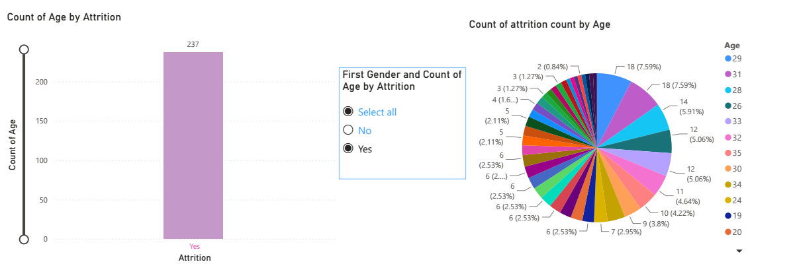

# HR Employee Attrition Analysis

End-to-end data analyst project on the IBM HR Analytics Employee Attrition dataset:
data cleaning → exploratory analysis across every key segment → interactive Power BI dashboard.

## Business question
Which employees are most likely to leave, and what factors — department, role, overtime,
compensation, tenure, age, gender, and travel demands — drive that risk, so HR can
prioritize retention efforts where they matter most?

## Dataset
[IBM HR Analytics Employee Attrition & Performance](https://www.kaggle.com/datasets/pavansubhasht/ibm-hr-analytics-attrition-dataset)
— 1,470 employee records, 32 analysis-ready columns after cleaning.

## Repository structure
```
hr-attrition-analysis/
├── data/
│   ├── raw/                     # original dataset
│   └── cleaned_hr_data.csv      # cleaned dataset (Power BI source)
├── dashboard/
│   └── hr_dashboard.pdf         # exported Power BI dashboard
├── README.md
└── requirements.txt
```

## 1. Data cleaning

```python
import pandas as pd

# Load, deduplicate, and standardize
df = pd.read_csv("raw_hr_data.csv").drop_duplicates()
df.columns = df.columns.str.strip().str.lower().str.replace(" ", "_")

# Feature engineering for age group brackets
bins = [17, 25, 35, 45, 55, 100]
labels = ["18-25", "26-35", "36-45", "46-55", "55+"]
df["age_group"] = pd.cut(df["age"], bins=bins, labels=labels)

# Export processed dataset
df.to_csv("cleaned_hr_data.csv", index=False)

- By using this python command it settles down all unclean data
- Removed 3 zero-variance columns with no analytical value: `EmployeeCount`, `Over18`, `StandardHours`
- Verified no null values or duplicate rows
- Standardized categorical text values (`Yes`/`No`, department and role names) for consistent grouping
- Final cleaned dataset: **1,470 rows x 32 columns**, ready to load directly into Power BI or Python

## 2. Headline number
**Overall attrition rate: 16.1%** (237 employees left out of 1,470)

## 3. Analysis by segment

### Department
| Department | Attrition Rate |
|---|---|
| Sales | 20.6% |
| Human Resources | 19.0% |
| Research & Development | 13.8% |

Sales has the highest departmental attrition, despite R&D being the largest department.

### Job Role
| Job Role | Attrition Rate |
|---|---|
| Sales Representative | 39.8% |
| Laboratory Technician | 23.9% |
| Human Resources | 23.1% |
| Sales Executive | 17.5% |
| Research Scientist | 16.1% |

**Sales Representative is the single riskiest role in the company** — nearly 4 in 10 leave.

### OverTime
| OverTime | Attrition Rate |
|---|---|
| Yes | 30.5% |
| No | 10.4% |

Employees working overtime leave at **almost 3x the rate** of those who don't — the
strongest binary predictor in the dataset.

### Marital Status
| Status | Attrition Rate |
|---|---|
| Single | 25.5% |
| Married | 12.5% |
| Divorced | 10.1% |

Single employees churn at roughly double the rate of married or divorced employees.

### Business Travel
| Travel Frequency | Attrition Rate |
|---|---|
| Travel_Frequently | 24.9% |
| Travel_Rarely | 15.0% |
| Non-Travel | 8.0% |

Attrition rises steadily with how often the role requires travel.

### Compensation & Tenure
| Metric | Stayed (No) | Left (Yes) |
|---|---|---|
| Avg Monthly Income | $6,833 | $4,787 |
| Avg Years at Company | 7.4 yrs | 5.1 yrs |
| Avg Distance From Home | 8.9 mi | 10.6 mi |

Employees who leave earn ~30% less on average, have shorter tenure, and commute farther.

### Stock Option Level
| Stock Option Level | Attrition Rate |
|---|---|
| 0 (none) | 24.4% |
| 1 | 9.4% |
| 2 | 7.6% |
| 3 | 17.6% |

Employees with **no stock options** leave at more than double the rate of those with
level 1 or 2 — equity stake appears to meaningfully improve retention (level 3 is a
small, noisier group).

### Gender
| Gender | Attrition Rate |
|---|---|
| Male | 17.0% |
| Female | 14.8% |

A modest gap — attrition is slightly more common among male employees.

### Age
- Attrition is concentrated in **younger employees**: the highest counts of leavers
  cluster around ages **29 (18 leavers), 31 (18), 28 (14), 26 (12) and 33 (12)**.
- Leaver counts drop off sharply after the mid-30s, consistent with the tenure finding
  above — early-career employees are the group most at risk.
- Percent Salary Hike by age stays flat (roughly 14–18% across all ages, correlation
  with age ≈ 0), meaning **salary hikes are not being used as a targeted lever** for
  the younger, higher-risk age groups — a gap worth addressing.

## 4. Dashboard (Power BI)
Exported dashboard: `dashboard/hr_dashboard.pdf`

**Visuals included:**
- **Count of Age by Attrition** — bar/gauge confirming 237 total employees left
- **Count of Attrition by Age** (pie/donut) — breakdown of leavers across every age,
  highlighting the 26–33 age band as the concentration point
- **Count of Attrition & Count of PercentSalaryHike by Age** (dual-line chart) — overlays
  attrition volume against salary hike counts per age, showing the two trends move
  independently of each other
- **Gender slicer** — filters all visuals by Male/Female to compare patterns across genders

## 5. Key takeaways
1. **Overtime is the #1 driver** — 30.5% vs 10.4% attrition, a ~3x gap.
2. **Early-career, early-tenure employees are highest risk** — ages 26–33 and <1 year
   tenure both show the steepest attrition.
3. **Sales Representatives** are the single most at-risk job role (39.8%).
4. **Compensation and equity matter** — leavers earn less on average and stock options
   below level 1 correlate with much higher attrition.
5. **Single employees and frequent travelers** churn well above the company average.
6. Salary hikes are currently **flat across age groups** — not targeted at the
   highest-risk younger cohort, a potential quick win for retention strategy.

## 📊 Executive Dashboard Preview



## Tools used
Python (pandas) for cleaning and segment analysis · Power BI for the interactive dashboard

## How to reproduce
```bash
pip install -r requirements.txt
```
Load `data/cleaned_hr_data.csv` into Power BI or a Python/pandas session to reproduce
the analysis above.

## Author
*Md.Samiul Islam — Data Analyst*
